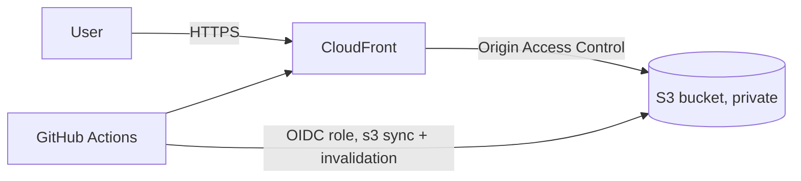

# Secure Static Portfolio Website on AWS

My portfolio site, hosted on AWS with a private S3 bucket behind CloudFront, deployed automatically by GitHub Actions.

**Live:** https://d2znb2lvgu973r.cloudfront.net

## Architecture

## AWS services and why

| Service | Why |
|---|---|
| S3 | Cheap, durable storage for static files. Block Public Access is on, so the bucket is never directly reachable. |
| CloudFront | HTTPS, caching at edge locations, and the only public entry point. |
| Origin Access Control | CloudFront signs its requests to S3 and the bucket policy trusts only this distribution. |
| IAM (OIDC role) | GitHub Actions gets short-lived credentials, so no access keys are stored. |

## Security decisions

- The bucket is private. A direct S3 URL returns `AccessDenied`; only CloudFront can read.
- The bucket policy allows `s3:GetObject` to `cloudfront.amazonaws.com` only when `AWS:SourceArn` matches this distribution.
- HTTP is redirected to HTTPS.
- The deploy role has least privilege: list, put and delete on this bucket, and create-invalidation on this distribution.
- The role trust policy is limited to one repository and the `main` branch.

## CI/CD

On every push to `main`, `.github/workflows/deploy.yml`:
1. Assumes the AWS role through OIDC.
2. Runs `aws s3 sync site/ --delete`.
3. Invalidates the CloudFront cache.

## Deployment steps

1. Create a private S3 bucket (Block Public Access on, versioning on).
2. Upload the `site/` files.
3. Create a CloudFront distribution with the bucket as origin, OAC, HTTP to HTTPS redirect, and `index.html` as default root object.
4. Apply the bucket policy for the distribution.
5. Add the GitHub OIDC provider, a least-privilege policy and a role in IAM.
6. Add repository secrets: `AWS_ROLE_ARN`, `AWS_REGION`, `S3_BUCKET`, `CLOUDFRONT_DISTRIBUTION_ID`.
7. Push to `main`.

## Problems and fixes

**1. Workflow did not run properly after the first push.**
All files were uploaded to the repository root, so `deploy.yml` was not in `.github/workflows/` and the site files were not in `site/`. I moved them into the expected folders and the workflow ran.

**2. `Not authorized to perform sts:AssumeRoleWithWebIdentity`.**
The trust policy looked correct, and the OIDC provider, role ARN and secrets all checked out. I added a temporary step that decoded the OIDC token and found that GitHub's `sub` claim now includes numeric IDs: `repo:khalid33-i@<owner-id>/aws-portfolio@<repo-id>:ref:refs/heads/main`. My condition used the older format, so `StringEquals` did not match. I updated the condition to the real value and removed the debug step.

**3. Over-broad trust policy from the console wizard.**
Leaving the repository and branch fields as `*` generated a wildcard condition that any repository in my account could use. I replaced it with an exact repository and branch.

## Screenshots

See `docs/screenshots/`: site on CloudFront, `AccessDenied` on the direct S3 URL, successful workflow run.

## Future improvements

- Custom domain with Route 53 and an ACM certificate (in `us-east-1`).
- CloudFront response headers policy for security headers.
- Infrastructure as code (Terraform or CloudFormation).
